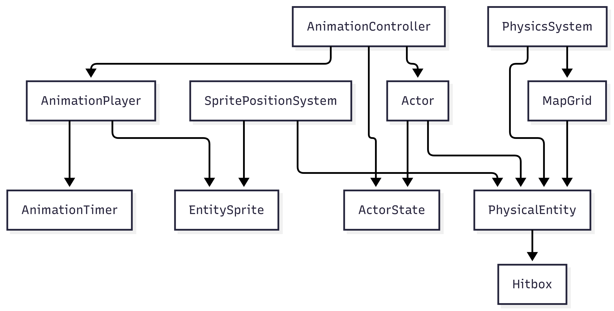

# Resumen general
Pequeño motor de platformer 2D creado para analizar programación orientada a objetos en C#.

## Arquitectura

### PhysicalEntity
Representa una entidad física del mundo. Contiene su posición, velocidad y una hitbox. 
No conoce el mapa ni otras entidades con las que puede chocar.

### Hitbox
Por ahora basicamente un rectángulo con un offset.

### MapGrid
Contiene una matriz de celdas con physEnts y cierta data adicional (tamaño de cada "celda", etc...).

Si A quiere moverse a un punto P no necesito pasar por toda PhysEnt a ver si hay colisión,
analizo las celdas que ocupará A si pisa P en O(1) con la matriz. 

Mientras más pequeñas sean las celdas, mayor será el consumo de memoria, pero menor será la cantidad de entidades candidatas a colisionar.

### PhysicsSystem
Centraliza toda la lógica de movimiento y colisiones.

Conoce el MapGrid y las PhysicalEntity, aplica gravedad, mueve las entidades resolviendo colisiones y actualiza la estructura espacial del mapa.

Actúa como mediador entre PhysicalEntity y MapGrid, evitando dependencias directas entre ambas clases y concentrando toda la lógica física en un único lugar.

### Actor
Un actor tiene una PhysEnt asociada, datos relevantes para sus acciones (movespeed, cuanto tiempo dura mi salto...)
y una Behavior. 

Cada tick, el actor le ordena a la PhysEnt cómo moverse según lo dice su behavior. 

Ciertas acciones cambian el State del actor, por ejemplo atacar causa que durante 2 segundos uno pueda saltar o moverme.

Dicha implementación de estados facilita muchísimo agregar sprites y animaciones en el futuro.

### Behavior
Una behavior realiza ciertos chequeos en base a lo que conoce del actor y le ordena al mismo qué acción realizar.
Por ejemplo, la behavior del player simplemente lee el teclado para ver hacia dónde moverse o cuándo atacar, mientras que
la behavior de un enemigo ordenaría constantemente moverse hacia cierto punto P (donde estaría parado el player).

### Filosofía de diseño
*PhysicalEntity* únicamente conoce física.

*Actor* únicamente conoce reglas de juego y comportamiento.

*PhysicsSystem* resuelve movimientos y colisiones físicas.

*Behavior* decide qué quiere hacer un actor.

Cada clase tiene una única responsabilidad, lo que facilita extender el motor con nuevas entidades, IA y mecánicas sin modificar el resto del sistema.

